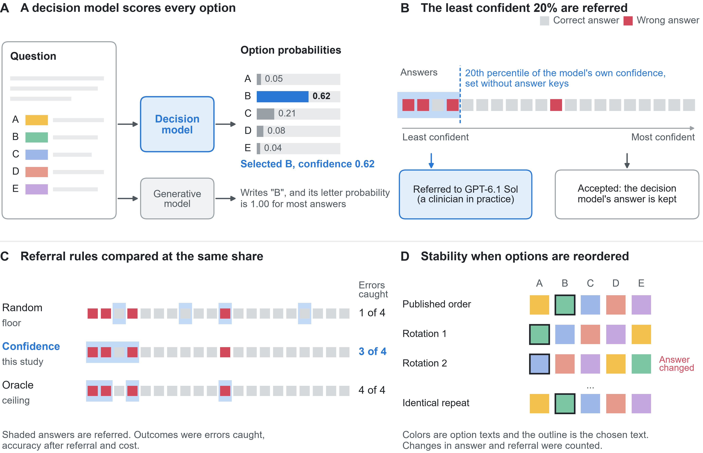
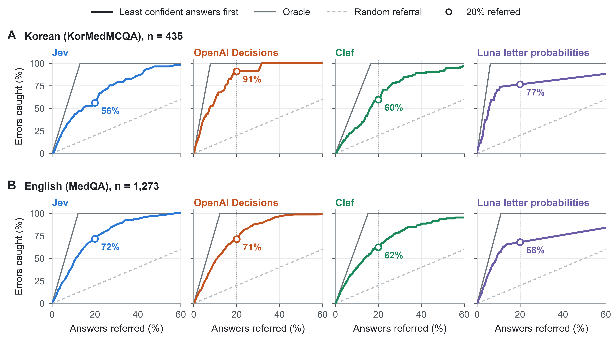
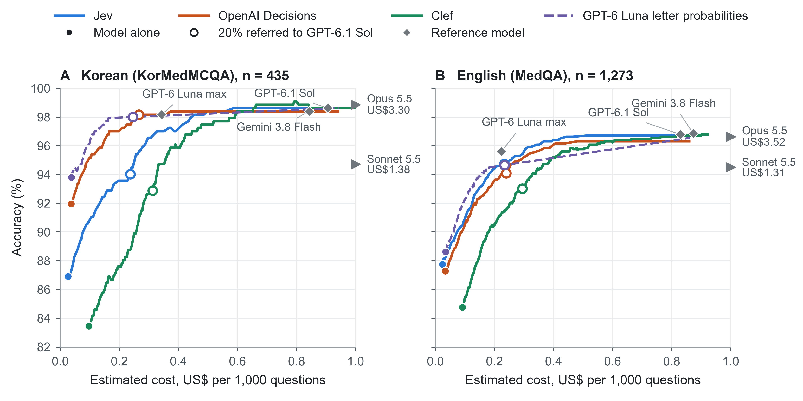
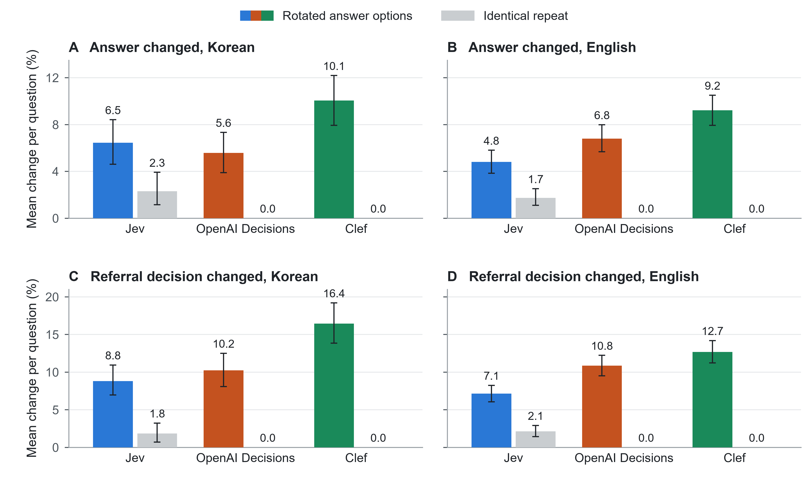

# Referring uncertain answers by decision-model confidence: Jev, OpenAI Decisions and Clef on Korean and US medical licensing examination questions

**Sangzin Ahn, MD, PhD** (ORCID 0000-0003-2749-0014)

Department of Pharmacology and Institute of Pharmacogenomics and Precision Medicine, Inje University College of Medicine, Busan, Korea

Cardiovascular and Metabolic Diseases Medical Research Center, Inje University College of Medicine, Busan, Korea

Correspondence: Sangzin Ahn, sangzinahn@inje.ac.kr

## Abstract

**Background** Decision models return a probability for each predefined answer option instead of generating text. If these probabilities identify unreliable answers, those answers could be referred to a clinician or a stronger model while the rest are accepted.

**Objective** To evaluate whether the probabilities of three decision models identify their errors on medical licensing questions and what referral of the least confident answers achieves.

**Methods** This exploratory in silico study used all 435 KorMedMCQA doctor test questions and all 1,273 MedQA test questions. Jev, OpenAI Decisions and Clef were compared with answer-letter probabilities from GPT-6 Luna, the generative model on which OpenAI Decisions is built. Each model's least confident 20% of answers were referred to GPT-6.1 Sol, and the result was compared with random referral and with an oracle that knows which answers are wrong. Rotation of the answer options tested the stability of referral decisions.

**Results** The decision models answered 83.4% to 92.0% of Korean and 84.8% to 87.7% of English questions correctly, with error-detection areas under the receiver operating characteristic curve (AUROCs) of 0.856 to 0.935 and 0.864 to 0.903. Luna letter probabilities were exactly one for most answers, and OpenAI Decisions ranked errors better than the letter probabilities of its base model, by 0.091 (95% CI 0.007 to 0.180) in Korean and 0.104 (0.062 to 0.147) in English. The least confident 20% of answers held 56% to 91% of Korean and 62% to 72% of English errors. Referring them to GPT-6.1 Sol raised accuracy by 6 to 9 percentage points, achieving 49% to 91% of the gain available to an oracle, at a quarter to a third of Sol's cost. Rotating options changed 7% to 16% of referral decisions. In English, errors made with high confidence were stable under rotation and often shared by other models.

**Conclusions** Decision-model probabilities identified most errors and allowed a fixed share of answers to be referred to a stronger model at a fraction of its cost, whereas a generative model's letter probabilities were mostly saturated. Confident errors and order-dependent referral remained, and prospective evaluation with clinicians is needed.

## Introduction

A new class of models, called decision models, returns a probability distribution over options defined by the caller instead of generating text [1,2]. TypeSafe AI released Jev in September 2026 [1]. Within weeks, OpenAI announced a decision endpoint built on its GPT-6 Luna model in limited preview [3,4], and Cloudflare released open-weight decision models [5]. An early evidence audit counted 28 papers posted within nine days of Jev's release, a sign of rapid interest [6]. Decision models revisit an older idea, scoring candidate labels supplied at inference time, as in entailment-based zero-shot classifiers [7] and the GLiNER entity recognizers [8], including a biomedical version [9]. They pair this fixed-answer design with the broad knowledge of large language models, whose versatility comes with the latency and cost of generating text. For clinical use, the relevant question is whether their probabilities are useful.

One proposed use is referral. A less expensive model answers first and refers uncertain answers to a clinician or a stronger model. Uncertainty estimates that allow abstention have been proposed as a condition for safe clinical deployment [10], and learned deferral to clinicians improved accuracy with lower estimated clinician workload in retrospective screening evaluations [11]. Outside medicine, cascades that call expensive models only for uncertain queries have reduced cost [12]. Such designs work only if a model gives lower confidence to its errors than to its correct answers. In medical question answering, token probabilities discriminated errors better than stated confidence, although calibration remained imperfect [13]. These probabilities are practical only when the answer is a single token, such as an option letter, because the probability of a longer generated answer is spread over many alternative token sequences. Whether the native probabilities of decision models offer more than these answer-letter probabilities remains unsettled [6].

Two further issues affect referral. Reordering the answer options can change multiple-choice predictions [14,15], and therefore referral decisions, even when the content is unchanged. Some errors also reflect the questions themselves. Physicians reviewing MedQA found missing information, questionable keys or several acceptable answers [16], and many errors on KorMedMCQA involved Korean healthcare regulations [17].

Earlier evaluations of Jev covered automated judging with confidence-guided escalation [18], classification tasks [19], English medical questions [20] and radiology reports [21]. This study evaluated three decision models from different vendors, Jev, OpenAI Decisions and Clef, on medical licensing questions in two languages, and compared a decision model with the letter probabilities of its base model. It asked whether their probabilities identify their errors and what referral of the least confident answers achieves, and it examined the stability of referral decisions and the errors that remain.

## Methods

### Study design and datasets

This exploratory in silico study used public examination datasets, and all model requests were made between 17 September and 7 October 2026. The 20% referral share, the oracle comparison and the error analyses were defined after initial results were available. Figure 1 summarizes the design. Reporting follows the TRIPOD-LLM guideline [22], and the completed checklist is provided as a supplementary file.

**Figure 1. Study design.** (A) A decision model returns a probability for each answer option, and the probability of the selected option serves as its confidence. The probability that a generative model assigns to its answer letter is exactly one for most answers. (B) Each model's least confident 20% of answers, those below the 20th percentile of its own confidence, were replaced with the answers of GPT-6.1 Sol, which stands in for a clinician or a stronger model. The remaining answers were accepted. (C) Confidence-based referral was compared with random referral and with an oracle that refers the same number of answers knowing which are wrong. (D) Options were rotated across the answer letters, and an unchanged request was repeated, to test whether answers and referral decisions changed. Squares represent answers ordered by confidence, and all values are illustrative.

The Korean cohort comprised all 435 doctor test questions from the 2022 to 2024 KorMedMCQA examinations [17], each with five options. The English cohort comprised all 1,273 MedQA test questions [23], each with four options. Questions, options and historical answer keys were used as released, including a few English questions that refer to figures absent from the text. Inputs were text only, and the two cohorts were analyzed separately.

### Decision models

Jev received each question and its options through its Choice interface [2], OpenAI Decisions through its decision endpoint [3] and Clef through Cloudflare Workers AI [5]. Each model received the same question, the same instruction to select one answer and the same options in the published order, without translation, retrieval or prompt tuning. The probability of the selected option served as the model's confidence. Each model also returned a separate confidence field, examined in a secondary comparison. For Jev, this field is derived from the option probabilities [24]. Model identifiers and versions are listed in Supplementary Table 1.

### Generative comparisons

For the letter-probability baseline, GPT-6 Luna without reasoning was constrained to answer with a single option letter, and the probability it assigned to that letter served as its confidence. Because OpenAI describes its decision endpoint as built on GPT-6 Luna [4], this baseline shows what the base generative model's own probabilities offer. Six configurations of five large language models from three providers served as reference models for accuracy and cost (Supplementary Table 1). GPT-6.1 Sol at low reasoning effort, among the most accurate of these at a moderate cost, served as the referral destination.

### Outcomes and statistical analysis

Accuracy was agreement with the official key over all questions, with refusals and malformed outputs counted as incorrect, and was reported with Wilson 95% confidence intervals. Error-detection AUROC measured how well one minus the selected-option probability identified wrong answers. Calibration was summarized by expected calibration error, and saturation by the share of answers with a probability of exactly one. Other confidence intervals used 4,000 bootstrap resamples of questions. AUROC differences between models are descriptive, because each model is scored on its own errors, and comparisons were not adjusted for multiplicity.

### Referral

Referral was simulated after data collection. Each model's least confident 20% of answers were replaced with the answers that GPT-6.1 Sol had given to the same questions, as if those questions had been passed to the stronger model. Errors caught was the share of the model's errors that fell within the referred answers. Each result was compared with random referral of the same number of answers and with an oracle, a hypothetical rule that refers the same number of answers knowing which are wrong. The gain achieved was the improvement over random referral as a share of the oracle's improvement. Errors caught and accuracy were also computed for every referral share. Costs were token-price estimates at list prices, counting the decision model on every question and Sol on referred questions (Supplementary methods).

### Answer-order experiment

Each decision model also answered every question with its options rotated cyclically across the answer letters, together with an unchanged-order request and an identical repeat of it. Answers were mapped back to the original option texts, and the share of rotations that changed the answer or the referral decision was compared with the change on identical repetition.

### Error analysis

Errors within each model's least confident 20% were termed cautious and the remainder confident. The two groups were compared on stability under rotation, correction by GPT-6.1 Sol, the accuracy of the reference models on the same questions and agreement of GPT-6 Luna without reasoning with the model's wrong answer. Korean questions were labeled by GPT-6.1 Sol for whether the answer depends on Korean law or administration, without access to keys or model answers, and the labels were checked against a blinded review by the author (Supplementary methods). For MedQA, published ratings from three or four US physicians per question were matched to every question [16]. Questions that most raters judged to lack information, to have no acceptable official answer or to have several acceptable answers were termed physician-flagged, and a sensitivity analysis repeated the main analyses without them. Official keys were used throughout.

## Results

### Accuracy and confidence

The decision models answered 83.4% to 92.0% of Korean and 84.8% to 87.7% of English questions correctly, with error-detection AUROCs of 0.856 to 0.935 and 0.864 to 0.903 (Table 1 and Supplementary Table 2). OpenAI Decisions refused a few questions, which counted as errors. Clef never assigned a probability of exactly one, whereas Jev and OpenAI Decisions did for 17% to 43% of answers. The reference models were more accurate, at 89.4% to 98.9%, but apart from GPT-6 Luna without reasoning they cost 0.22 to 3.52 US dollars per 1,000 questions against 0.02 to 0.10 for the decision models (Table 2).

**Table 1. Accuracy and error ranking of the decision models and of GPT-6 Luna letter probabilities.** Accuracy counts invalid and refused answers as incorrect, over 435 Korean and 1,273 English questions. Error AUROC measures how well a low selected-option probability identifies a wrong answer. ECE, expected calibration error. GPT-6 Luna letter probabilities come from a separate collection with token log probabilities.

| Cohort | Model | Accuracy, % (95% CI) | Error AUROC (95% CI) | ECE | Answers at probability 1, % | Cost, US$ per 1,000 |
| --- | --- | --- | --- | ---: | ---: | ---: |
| Korean | Jev 1.13.0 | 86.9 (83.4 to 89.7) | 0.861 (0.816 to 0.902) | 0.043 | 16.6 | 0.0266 |
|  | OpenAI Decisions | 92.0 (89.0 to 94.2) | 0.935 (0.904 to 0.962) | 0.044 | 25.8 | 0.0372 |
|  | Clef | 83.4 (79.7 to 86.6) | 0.856 (0.808 to 0.898) | 0.061 | 0.0 | 0.0967 |
|  | GPT-6 Luna letter probabilities | 93.8 (91.1 to 95.7) | 0.844 (0.750 to 0.927) | 0.043 | 88.7 | 0.0375 |
| English | Jev 1.13.0 | 87.7 (85.8 to 89.4) | 0.899 (0.878 to 0.919) | 0.009 | 33.4 | 0.0238 |
|  | OpenAI Decisions | 87.3 (85.3 to 89.0) | 0.903 (0.882 to 0.923) | 0.028 | 43.0 | 0.0338 |
|  | Clef | 84.8 (82.7 to 86.6) | 0.864 (0.835 to 0.890) | 0.020 | 0.0 | 0.0918 |
|  | GPT-6 Luna letter probabilities | 88.6 (86.7 to 90.2) | 0.799 (0.758 to 0.839) | 0.077 | 86.2 | 0.0342 |

**Table 2. Accuracy and cost of the reference models.** Each generative model answered every question once, with invalid, refused or incomplete answers counted as incorrect. Cost includes reasoning or thinking tokens. Settings are listed in Supplementary Table 1.

| Model | Korean accuracy, % (95% CI) | Korean cost, US$ per 1,000 | English accuracy, % (95% CI) | English cost, US$ per 1,000 |
| --- | --- | ---: | --- | ---: |
| GPT-6.1 Sol low | 98.6 (97.0 to 99.4) | 0.9056 | 96.8 (95.7 to 97.6) | 0.8302 |
| Claude Opus 5.5 low | 98.9 (97.3 to 99.5) | 3.3039 | 96.6 (95.5 to 97.5) | 3.5188 |
| Gemini 3.8 Flash low | 98.4 (96.7 to 99.2) | 0.8430 | 96.9 (95.7 to 97.7) | 0.8728 |
| GPT-6 Luna max | 98.2 (96.4 to 99.1) | 0.3433 | 95.6 (94.3 to 96.6) | 0.2240 |
| Claude Sonnet 5.5 low | 94.7 (92.2 to 96.5) | 1.3764 | 94.5 (93.1 to 95.6) | 1.3122 |
| GPT-6 Luna none | 93.1 (90.3 to 95.1) | 0.0375 | 89.4 (87.6 to 91.0) | 0.0342 |

Each model's separately reported confidence field ranked errors almost identically but was systematically lower than the selected probability and generally less well calibrated (Supplementary Table 3).

GPT-6 Luna letter probabilities had similar accuracy but were exactly one for 88.7% of Korean and 86.2% of English answers. OpenAI Decisions ranked its errors better than the letter probabilities of its base model, with an AUROC higher by 0.091 (95% CI 0.007 to 0.180) in Korean and 0.104 (0.062 to 0.147) in English. Pairwise differences among the decision models are listed in Supplementary Table 4.

### Referring the least confident fifth

The least confident 20% of answers held 56% to 91% of Korean and 62% to 72% of English errors (Table 3 and Figure 2). Referring them to GPT-6.1 Sol raised accuracy by 6.2 to 9.4 percentage points, more than random referral of the same number of answers for every model, and achieved 49% to 91% of the oracle's gain in Korean and 54% to 65% in English. The least confident half of answers held over 90% of each model's errors (Supplementary Table 5).

**Table 3. Referral of each model's least confident 20% of answers to GPT-6.1 Sol.** Each model referred 87 Korean and 255 English answers. Errors caught is the share of the model's errors among the referred answers. Accuracy after referral replaces the referred answers with GPT-6.1 Sol answers and is compared with random referral and with an oracle that refers known errors first. Gain achieved is the improvement over random referral as a share of the oracle's improvement. GPT-6.1 Sol alone answered 98.6% of Korean and 96.8% of English questions correctly at US$0.906 and US$0.830 per 1,000 questions.

| Cohort | Model | Errors caught, % (95% CI) | Accuracy after referral, % (95% CI) | Random referral, % | Oracle, % | Gain achieved, % | Cost, US$ per 1,000 |
| --- | --- | --- | --- | ---: | ---: | ---: | ---: |
| Korean | Jev 1.13.0 | 56.1 (45.9 to 71.4) | 94.0 (91.7 to 96.6) | 89.2 | 99.1 | 49 | 0.237 |
|  | OpenAI Decisions | 91.2 (76.9 to 100.0) | 98.2 (96.4 to 99.3) | 93.2 | 98.6 | 91 | 0.266 |
|  | Clef | 59.7 (50.7 to 73.6) | 92.9 (90.1 to 95.9) | 86.5 | 99.5 | 49 | 0.313 |
|  | GPT-6 Luna letter probabilities | 76.6 (61.0 to 90.9) | 98.0 (96.6 to 99.1) | 94.8 | 99.1 | 75 | 0.246 |
| English | Jev 1.13.0 | 71.6 (65.3 to 78.8) | 94.7 (93.5 to 96.0) | 89.5 | 97.6 | 65 | 0.234 |
|  | OpenAI Decisions | 71.4 (65.4 to 79.3) | 94.1 (92.8 to 95.6) | 89.1 | 97.3 | 61 | 0.240 |
|  | Clef | 62.4 (56.7 to 69.3) | 93.0 (91.6 to 94.5) | 87.2 | 98.0 | 54 | 0.294 |
|  | GPT-6 Luna letter probabilities | 68.0 (61.0 to 75.1) | 94.7 (93.4 to 95.8) | 90.2 | 97.5 | 61 | 0.234 |

**Figure 2. Errors caught when each model refers its least confident answers.** Each panel ranks one model's valid answers from least to most confident and plots the share of its errors among the referred answers against the share of answers referred. (A) Korean questions. (B) English questions. The grey line is an oracle that refers errors first, the dashed line is random referral and open circles mark 20% referred. For GPT-6 Luna letter probabilities the curve becomes straight once only answers at probability 1 remain, because their order is then random.

This referral cost about a quarter to a third as much as using GPT-6.1 Sol alone (Figure 3). GPT-6 Luna at maximum effort alone reached similar or higher accuracy at a similar cost (Table 2).

**Figure 3. Accuracy and cost of referring the least confident answers to GPT-6.1 Sol.** (A) Korean questions. (B) English questions. Each curve starts at a model alone (filled circle) and replaces its answers with GPT-6.1 Sol answers in order of increasing confidence until every valid answer is replaced. Open circles mark 20% referred, and grey diamonds are the reference models in Table 2. Claude Opus 5.5 and Claude Sonnet 5.5 cost more than US$1 per 1,000 questions and are shown as arrows at the right edge, labelled with their cost. Cost includes the model on every question and Sol on referred questions.

Letter probabilities performed comparably at this share, catching 77% of Korean and 68% of English errors, because the 11% to 14% of Luna answers below one held many errors. Beyond that point their ranking reduced to random choice among tied answers (Figure 2).

### Stability of referral decisions

OpenAI Decisions and Clef returned identical outputs on every identical repeat, whereas Jev's answer changed on about 2% of repeats. Rotating the options changed answers on 4.8% to 10.1% of rotations and referral decisions on 7.1% to 16.4% (Figure 4 and Supplementary Table 6). For referral decisions this exceeded identical repetition by 5.0 to 16.4 percentage points, with every 95% confidence interval above zero. Mean accuracy across rotations stayed within 1.5 percentage points of unchanged-order accuracy.

**Figure 4. Changes in answers and referral decisions when the answer options were reordered.** Bars show the mean share of nonzero rotations (colored) or of one identical repeat (grey) in which the outcome differed from a contemporary unchanged-order request. (A, B) Selected answer in Korean and English questions. (C, D) Referral decision, at each model's threshold for its least confident 20% of answers, in Korean and English questions. Error bars are 95% bootstrap intervals. Identical repeats of OpenAI Decisions and Clef never changed.

### Where errors remained

In English, confident errors differed from cautious errors in the same way for all three models (Table 4). They rarely changed under rotation (3% to 15% of rotations, against 33% to 49% for cautious errors), fell on questions that the reference models also found difficult and more often matched the wrong answer of GPT-6 Luna without reasoning. GPT-6.1 Sol corrected fewer of them, and a physician majority more often endorsed the model's answer. In Korean the pattern held for Jev, whereas OpenAI Decisions left only 3 confident errors and Clef's confident errors were nearly as unstable as its cautious errors (Supplementary Table 7).

**Table 4. Cautious and confident errors in English.** Cautious errors fall within the model's least confident 20% of answers, at a selected probability of 0.770 or less for Jev, 0.800 or less for OpenAI Decisions and 0.739 or less for Clef. Confident errors lie above these thresholds. Rotation changes come from the answer-order experiment. Reference accuracy is the mean accuracy of the six reference models on the same questions.

| Measure | Jev, cautious | Jev, confident | OpenAI Decisions, cautious | OpenAI Decisions, confident | Clef, cautious | Clef, confident |
| --- | ---: | ---: | ---: | ---: | ---: | ---: |
| Errors, n | 113 | 42 | 112 | 44 | 121 | 73 |
| Answer changed under rotation, % | 33.3 | 3.2 | 41.2 | 11.1 | 49.0 | 15.1 |
| Corrected by GPT-6.1 Sol, % | 85.0 | 69.0 | 83.0 | 79.5 | 91.7 | 78.1 |
| Mean reference accuracy, % | 78.8 | 62.3 | 72.6 | 67.0 | 84.6 | 68.7 |
| GPT-6 Luna none chose the same wrong option, % | 29.2 | 61.9 | 50.9 | 72.7 | 28.9 | 49.3 |
| Physician-majority flagged, % | 40.7 | 45.2 | 35.7 | 36.4 | 28.9 | 37.0 |
| Physician majority chose the model's answer, % | 10.6 | 19.0 | 7.1 | 18.2 | 6.6 | 13.7 |

Questions whose answer depends on Korean law or administration formed 16% of the Korean cohort but 33% to 54% of the decision models' errors (Supplementary Table 8), a weakness shared by most reference models. Most of these errors fell within each model's least confident 20%, and all of them for OpenAI Decisions. In one example, all three decision models chose disclosure of a soldier's HIV infection to the patient alone, whereas the key, reflecting an examination-era legal exception for military settings, also required notifying the unit commander (Supplementary Table 9).

Physician-flagged questions formed 15% of the English cohort but held 32% to 42% of the decision models' errors. Excluding them raised every model's accuracy and error AUROC and left the comparisons unchanged (Supplementary Table 10). The three decision models were all wrong on 63 English questions, and a physician majority had flagged half of them.

## Discussion

The native probabilities of three decision models identified most of their errors on Korean and US licensing questions. Referring the least confident fifth of answers caught 56% to 91% of errors, and referral to a stronger model raised accuracy by 6 to 9 percentage points at a quarter to a third of that model's cost. Because the referral share is set from the models' own confidence, the approach can be put in place before any outcomes are labeled. Figures 2 and 3 show the same tradeoff at other workloads.

The letter-probability comparison contrasts a decision model with the probabilities of its base generative model. OpenAI Decisions ranked errors clearly better than the answer-letter probabilities of GPT-6 Luna, which were nearly always exactly one. Letter probabilities nonetheless matched the decision models at a 20% referral share, because the few answers they scored below one contained many errors. Beyond those answers, about one in eight, they could not rank the rest. A decision model should therefore be compared with the strongest simple alternative at the same referral share [6], and a high AUROC should not be read as an accurate chance of clinical correctness [13].

The 20% share set a workload rather than a tolerance for error. A referral share can be matched to reviewer capacity using confidence values alone. Controlling the error rate among accepted answers instead requires labeled validation data, as in selective classification [25], and conformal risk control offers related guarantees on expected loss [26]. Neither guarantee was evaluated here.

Referral changed the kind of errors that remained. Cautious errors were unstable under option rotation and usually corrected, as expected when probability is split between close options. In English, confident errors of all three models were stable under rotation and often matched the wrong choice of other models. A salient pattern may outweigh the detail that changes the answer, or the key itself may be disputed, since physicians more often endorsed the model's answer for confident errors. Consistent with reports that models answer confidently when no correct option exists [27], such errors escape confidence thresholds and consistency checks, and their frequency needs auditing, for example by reviewing a random sample of confident answers.

The cohorts showed different persistent errors. In Korean, national law and administration remained a weak point for nearly every model, consistent with the KorMedMCQA authors' attribution of 34% of errors in a selected multiprofession sample to Korean healthcare law and regulations [17]. Low confidence flagged most of these errors. Even so, decisions that depend on local law or regulation should be validated in each jurisdiction where a decision model is used. In English, questions that all decision models missed were often questions that physicians themselves disputed, consistent with an independent physician review of MedQA [16], so accuracy near the benchmark ceiling partly reflects agreement with historical keys.

Option order affected referral for every model. Previous studies found that option order can change multiple-choice predictions [14,15]. Here, OpenAI Decisions and Clef were fully repeatable, yet rotating fixed answer texts changed about one in ten of their referral decisions while aggregate accuracy barely changed. Evaluations should therefore report the stability of individual decisions, not only aggregate accuracy.

This exploratory study has four main limitations. First, several analyses, including the referral share and the oracle comparison, were chosen after earlier results were known. Second, examination questions differ from clinical decisions. The models may have seen these public questions during training, the keys reflect historical examinations rather than current practice, and the Korean and English cohorts differ in more than language. Third, the models were accessed through commercial services at different times, without disclosed implementation details, and costs are list-price estimates. Fourth, referral was simulated with another model's answers, so the benefit of referring to clinicians, and the explanations proposed for confident errors, remain to be tested. The next step is evaluation in real clinical workflows, where a decision model triages actual cases and clinicians review the referred share.

## Conclusions

Decision models return option probabilities that can be used directly to decide which answers need a second look. On Korean and US licensing questions, referring each model's least confident fifth of answers caught most of its errors and recovered most of a stronger model's accuracy at a fraction of its cost, and the referral share can be set without knowing which answers are correct. Licensing questions only approximate clinical decisions. Even so, decision models could act as a first reader in well-bounded clinical tasks, with a clinician reviewing a fixed share of the least confident answers. Such use would need local validation and periodic audits of confident answers, since confident errors and order-dependent referral remained.

## Declarations

**Ethics statement** This study analysed publicly released examination questions and model outputs. It involved no human participants, patient data or identifiable personal information, and institutional review board review was therefore not required.

**Registration and patient involvement** Study protocols and analysis code are available in the code repository. The study was not registered. No patients or members of the public were involved in the design, conduct or reporting of this research.

**Funding** This research was supported by the National Research Foundation of Korea (NRF), funded by the Korean government (MSIT) (RS-2025-02214129). The funder had no role in study design, data collection, analysis, interpretation or writing of the manuscript.

**Competing interests** The author declares no competing interests. Jev, OpenAI Decisions and Clef were used through standard accounts on the same terms as other users. TypeSafe AI, OpenAI and Cloudflare had no role in study design, data collection, analysis, interpretation or writing.

**Data and code availability** Code, protocols, model outputs and analysis summaries are available at https://github.com/mahlernim/decision-model-referral. Examination questions in the repository come from the public KorMedMCQA (CC BY-NC 2.0) and MedQA (MIT licence) releases at the recorded revisions and remain under their original licences. The physician ratings of MedQA are available from their original release [16] at https://github.com/google-health/med-gemini-medqa-relabelling.

**Use of AI tools** OpenAI Codex and Anthropic Claude Code assisted with analysis code. Korean content labels and draft characterizations of selected errors were produced with GPT-6.1 Sol. The author reviewed all code, outputs and text and takes full responsibility for the content.

**Author contributions** SA conceived and designed the study, conducted the experiments and analyses, interpreted the results and wrote the manuscript.

## References

1. Almeida D. Introducing System One Models & Jev. TypeSafe AI blog. 15 September 2026. https://typesafe.ai/blog/introducing-system-one-models-and-jev

2. TypeSafe AI. Choice. TypeSafe AI documentation. Accessed 22 September 2026. https://docs.typesafe.ai/primitives/choice

3. OpenAI. Decisions. OpenAI API documentation. Accessed 7 October 2026. https://developers.openai.com/api/docs/guides/decisions

4. OpenAI. DevDay 2026 Recap. 29 September 2026. https://openai.com/index/devday-2026-recap/

5. Chen M, Reneau A, Flansburg K. Introducing Clef: our open-source decision models, and new RL fine-tuning platform. Cloudflare blog. 1 October 2026. https://blog.cloudflare.com/clef-decision-models/

6. Tang L, Zheng Y. Typed Decision Models: An Early Evidence Audit and Evaluation Checklist. arXiv. 2026. https://arxiv.org/abs/2609.32160

7. Yin W, Hay J, Roth D. Benchmarking Zero-shot Text Classification: Datasets, Evaluation and Entailment Approach. Proceedings of EMNLP-IJCNLP 2019. 2019. p. 3914-3923. https://doi.org/10.18653/v1/D19-1404

8. Zaratiana U, Tomeh N, Holat P, Charnois T. GLiNER: Generalist Model for Named Entity Recognition using Bidirectional Transformer. Proceedings of the 2024 Conference of the North American Chapter of the Association for Computational Linguistics: Human Language Technologies (Volume 1: Long Papers). 2024. p. 5364-5376. https://doi.org/10.18653/v1/2024.naacl-long.300

9. Yazdani A, Stepanov I, Teodoro D. GLiNER-BioMed: A Suite of Efficient Models for Open Biomedical Named Entity Recognition. arXiv. 2025. Version 2. https://arxiv.org/abs/2504.00676v2

10. Kompa B, Snoek J, Beam AL. Second opinion needed: communicating uncertainty in medical machine learning. npj Digital Medicine. 2021;4:4. https://doi.org/10.1038/s41746-020-00367-3

11. Dvijotham K, Winkens J, Barsbey M, Ghaisas S, Stanforth R, Pawlowski N, et al. Enhancing the reliability and accuracy of AI-enabled diagnosis via complementarity-driven deferral to clinicians. Nature Medicine. 2023;29(7):1814-1820. https://doi.org/10.1038/s41591-023-02437-x

12. Chen L, Zaharia M, Zou J. FrugalGPT: How to Use Large Language Models While Reducing Cost and Improving Performance. Transactions on Machine Learning Research. 2024. https://openreview.net/forum?id=cSimKw5p6R

13. Bentegeac R, Le Guellec B, Kuchcinski G, Amouyel P, Hamroun A. Token Probabilities to Mitigate Large Language Models Overconfidence in Answering Medical Questions: Quantitative Study. Journal of Medical Internet Research. 2025;27:e64348. https://doi.org/10.2196/64348

14. Pezeshkpour P, Hruschka E. Large Language Models Sensitivity to The Order of Options in Multiple-Choice Questions. Findings of the Association for Computational Linguistics: NAACL 2024. 2024. p. 2006-2017. https://doi.org/10.18653/v1/2024.findings-naacl.130

15. Zheng C, Zhou H, Meng F, Zhou J, Huang M. Large Language Models Are Not Robust Multiple Choice Selectors. International Conference on Learning Representations. 2024. https://proceedings.iclr.cc/paper_files/paper/2024/hash/54dd9e0cff6d9214e20d97eb2a3bae49-Abstract-Conference.html

16. Saab K, Tu T, Weng WH, Tanno R, Stutz D, Wulczyn E, et al. Capabilities of Gemini Models in Medicine. arXiv. 2024. Version 2. https://arxiv.org/abs/2404.18416v2. Physician annotations at https://github.com/google-health/med-gemini-medqa-relabelling

17. Kweon S, Choi B, Chu G, Song J, Hyeon D, Gan S, et al. KorMedMCQA: Multi-Choice Question Answering Benchmark for Korean Healthcare Professional Licensing Examinations. arXiv. 2024. Version 3. https://arxiv.org/abs/2403.01469v3

18. Li Y, Miao Y, Krishnan R, Padman R. JEV-as-a-Judge: Accept When Confident, Escalate When Unsure. arXiv. 2026. Version 3. https://arxiv.org/abs/2609.26550v3

19. Deußer T, Sparrenberg L, Sifa R. Evaluating and Benchmarking the System One Model Jev. arXiv. 2026. https://arxiv.org/abs/2609.37647

20. Madrid-García A, Merino-Barbancho B. Jev in Medicine: A Benchmark Evaluation. arXiv. 2026. Version 3. https://arxiv.org/abs/2609.34024v3

21. Huang J, Yang H, Ma X, Liang X, Cai K, Ma J, et al. Can Jev Judge Radiology Reports? Evaluating a System One Model for Clinical Factuality. arXiv. 2026. https://arxiv.org/abs/2609.27607

22. Gallifant J, Afshar M, Ameen S, Aphinyanaphongs Y, Chen S, Cacciamani G, et al. The TRIPOD-LLM reporting guideline for studies using large language models. Nature Medicine. 2025;31(1):60-69. https://doi.org/10.1038/s41591-024-03425-5

23. Jin D, Pan E, Oufattole N, Weng WH, Fang H, Szolovits P. What Disease Does This Patient Have? A Large-Scale Open Domain Question Answering Dataset from Medical Exams. Applied Sciences. 2021;11(14):6421. https://doi.org/10.3390/app11146421

24. TypeSafe AI. Confidence. TypeSafe AI documentation. Accessed 22 September 2026. https://docs.typesafe.ai/confidence

25. Geifman Y, El-Yaniv R. Selective Classification for Deep Neural Networks. Advances in Neural Information Processing Systems 30. 2017. https://papers.nips.cc/paper_files/paper/2017/hash/4a8423d5e91fda00bb7e46540e2b0cf1-Abstract.html

26. Angelopoulos AN, Bates S, Fisch A, Lei L, Schuster T. Conformal Risk Control. International Conference on Learning Representations. 2024. https://proceedings.iclr.cc/paper_files/paper/2024/hash/f3549ef9b5ff520a7e41ff3cc306ab2b-Abstract-Conference.html

27. Griot M, Hemptinne C, Vanderdonckt J, Yuksel D. Large Language Models lack essential metacognition for reliable medical reasoning. Nature Communications. 2025;16:642. https://doi.org/10.1038/s41467-024-55628-6
